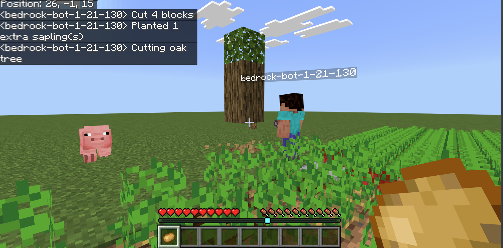

# Bedrock Demo

Demo project showcasing [Mineflayer](https://github.com/PrismarineJS/mineflayer) ported to Minecraft Bedrock Edition. Includes examples for bot creation, pathfinding, prismarine-viewer integration, and state machine patterns.



## Installation

```
git clone https://github.com/mc-zuri/node-bedrock-client-demo.git
npm i
npm run state-machine-farmer
```

or start new project

```
npm i --save github:mc-zuri/node-minecraft-data#bedrock
npm i --save github:mc-zuri/node-prismarine-chunk#bedrock
npm i --save github:mc-zuri/node-prismarine-viewer#bedrock
npm i --save github:mc-zuri/node-prismarine-registry#bedrock
npm i --save github:mc-zuri/node-prismarine-physics#bedrock
npm i --save github:mc-zuri/node-mineflayer#bedrock
```